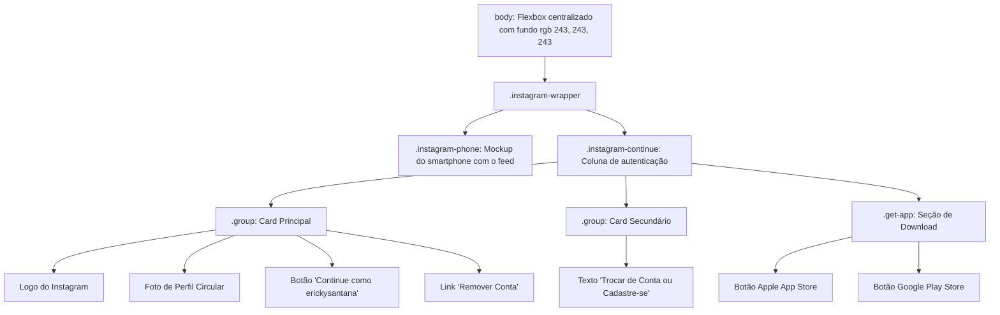

# 📸 Projeto Insta — Clone da Interface de Login do Instagram

<br />

<div align="center">
  
</div>

<br />

<div align="center">

[](https://projeto-insta-ixq4.vercel.app/)
[](https://developer.mozilla.org/pt-BR/docs/Web/HTML)
[](https://developer.mozilla.org/pt-BR/docs/Web/CSS)
[](https://www.dio.me/)
[](https://www.dio.me/)
[](LICENSE)
[](#)

</div>

---

## 🔗 Demonstração ao Vivo (Deploy)

A aplicação está disponível e hospedada na **Vercel**:

👉 **[Acesse o Projeto Insta Online](https://projeto-insta-ixq4.vercel.app/)**

---

## 📖 Visão Geral

O **Projeto Insta** é uma reprodução visual de alta fidelidade (*pixel perfection*) da clássica tela de login e autenticação web do **Instagram**, desenvolvida durante o bootcamp **Spread Fullstack Developer** na plataforma [Digital Innovation One (DIO)](https://www.dio.me/).

O projeto tem como foco o domínio prático de **CSS3 Flexbox**, estruturação semântica com **HTML5** e técnicas de **Design Responsivo** com Media Queries para adaptação fluida em telas de computadores, tablets e smartphones, dispensando frameworks pesados e priorizando código limpo, semântico e performático.

---

## ✨ Funcionalidades

* **Layout de Duas Colunas no Desktop:**
  * Mockup realista de smartphone (`instagram-celular.png`) apresentando a interface do feed social à esquerda.
  * Painel de autenticação dividido em cards modulares à direita.
* **Card de Acesso Rápido de Perfil:**
  * Logotipo oficial vetorial do Instagram (`instagram-logo.png`).
  * Foto de perfil circular com máscara de corte (`border-radius: 50%`) e overflow controlado.
  * Botão de ação primário (*"Continue como erickysantana"*) estilizado no azul característico `#0095f6`.
  * Link secundário para remoção de credencial ativa (*"Remover Conta"*).
* **Card de Troca de Conta e Cadastro:**
  * Área dedicada para alternância de perfil ou direcionamento de novos usuários (*"Não é erickysantana? Trocar de Conta ou Cadastre-se"*).
* **Seção de Download do Aplicativo:**
  * Botões padronizados e dimensionados para redirecionamento às lojas oficiais **Apple App Store** e **Google Play Store**.
* **Responsividade Automática para Dispositivos Móveis:**
  * Transição suave para coluna única em telas de até `680px`, ocultando o mockup do celular, expandindo o card de login para `100%` da largura útil e reestruturando os botões de download verticalmente.

---

## 🎯 Diferenciais e Destaques Técnicos

1. **Alinhamento Completo com CSS Flexbox:** Todo o posicionamento vertical e horizontal da interface (`.instagram-wrapper`, `.instagram-phone`, `.instagram-continue`, `.group`, `.download`) é orquestrado exclusivamente com propriedades nativas do Flexbox (`display: flex`, `flex-direction: column`, `justify-content: space-around/space-between`, `align-items: center`).
2. **Media Queries Cuidadosamente Calibradas:**
   * `@media (max-width: 1024px)`: Expande o wrapper central de 60% para 95% para acomodar telas médias.
   * `@media (max-width: 680px)`: Oculta o celular (`display: none`), remove as bordas dos cards para uma aparência nativa de app móvel e converte o background do body para branco limpo.
   * `@media (max-width: 300px)`: Proteção defensiva para telas ultracompactas com largura mínima travada em 300px.
3. **Estilização de Botões de Download via CSS:** Uso inteligente de tags de ancoragem estilizadas com `background-image` e `background-size: cover`, dispensando elementos `` redundantes no DOM para os selos de download da Apple e Google Play.
4. **Sem Dependências Externas (Pure Vanilla):** Zero bibliotecas CSS (sem Bootstrap ou Tailwind), garantindo renderização instantânea com tempo de carregamento inferior a 1 segundo.

---

## 🏗️ Arquitetura e Estrutura de Pastas

```bash
Projeto-Insta/
├── README.md                                  # Documentação técnica e instruções do repositório
├── index.html                                 # Estrutura semântica dos blocos de autenticação
├── style.css                                  # Estilização com Flexbox, cores e media queries
└── img/                                       # Ativos visuais e imagens de alta fidelidade
    ├── apple-button.png                       # Selo de download na Apple App Store
    ├── googleplay-button.png                  # Selo de download na Google Play Store
    ├── instagram-celular.png                  # Mockup do smartphone com a tela do Instagram
    ├── instagram-logo.png                     # Tipografia e logotipo oficial do Instagram
    └── perfil-instagram.jpg                   # Imagem circular de avatar do usuário
```

---

## 🔄 Estrutura de Blocos do Layout



---

## 🎨 UX, Design e Fidelidade de Interface

* **Paleta de Cores do Instagram:**
  * Azul Primário de Ação: `#0095f6` (Botões de login, links destacados e chamadas).
  * Cinza de Apoio / Fundo Neutro: `rgb(243, 243, 243)` (Fundo da página no desktop).
  * Borda dos Cards: `1px solid lightgray` (Delimitação sutil dos blocos brancos).
  * Cinza de Texto Secundário: `rgb(160, 160, 160)` (*"Não é erickysantana?"* e títulos de download).
* **Tipografia:** Fonte padrão `sans-serif` com tamanho base em `14px`, respeitando os padrões originais da rede social.

---

## 📸 Telas da Aplicação (Demonstração)

<details open>
<summary><b>🖥️ Visualização Desktop (1440px / Duas Colunas)</b></summary>

<br />

<div align="center">
  
</div>

</details>

<br />

<details>
<summary><b>📱 Visualização Mobile (Coluna Única e Card Expandido)</b></summary>

<br />

<div align="center">
  
</div>

</details>

---

## 📖 Passo a Passo de Uso

1. **Acessar a Aplicação:** Abra o [Link de Demonstração na Vercel](https://projeto-insta-ixq4.vercel.app/) ou abra o arquivo `index.html` em seu navegador.
2. **Visualizar no Desktop:** Observe o alinhamento centralizado com o celular demonstrativo ao lado esquerdo e o card com o perfil de login rápido.
3. **Simular Dispositivos Móveis:** Abra o DevTools (`F12`) e redimensione a tela ou alterne para modo móvel (abaixo de 680px) para conferir a adaptação instantânea da tela, ocultando a imagem do aparelho e focando na área de ação.

---

## 🎓 Objetivo do Projeto

Projeto acadêmico e prático realizado durante o bootcamp **Spread Fullstack Developer** na **Digital Innovation One (DIO)**, focado em:
* Prática intensiva de estilização moderna com **Flexbox**.
* Domínio de regras de responsividade com **Media Queries**.
* Recriação fidedigna de interfaces comerciais do mundo real (*UI Clone*).

---

## ⚙️ Requisitos e Instalação

### Pré-requisitos
* Qualquer navegador web moderno (Chrome, Edge, Firefox, Safari).
* [Git](https://git-scm.com/) para clonar o repositório.

### Instalação

1. Clone o repositório em sua máquina:
```bash
git clone https://github.com/erickystn/Projeto-Insta.git
```

2. Entre no diretório do projeto:
```bash
cd Projeto-Insta
```

---

## 🚀 Como Executar

Por ser composto exclusivamente de arquivos estáticos HTML e CSS, não há etapa de compilação ou instalação de dependências:

### Opção 1: Diretamente no Navegador
Dê um duplo clique no arquivo `index.html` ou arraste-o para o navegador.

### Opção 2: Servidor Local (Live Server / Python)
* **Com a extensão Live Server no VS Code:** Clique com botão direito em `index.html` e escolha *"Open with Live Server"*.
* **Com Python:**
  ```bash
  python3 -m http.server 3000
  ```
  Acesse: `http://localhost:3000`

---

## 💻 Exemplos de Código

### 1. Estrutura dos Cards no HTML (`index.html`)
```html
<div class="instagram-wrapper">
    <div class="instagram-phone">
        
    </div>

    <div class="instagram-continue">
        <div class="group">
            
            <div class="profile-photo"></div>
            <a href="#" class="instagram-login">Continue como erickysantana</a>
            <a href="#" class="instagram-logout">Remover Conta</a>
        </div>

        <div class="group">
            <p class="not-account">Nao e erickysantana</p>
            <p class="not-account">
                <span class="link-blue">Trocar de Conta</span> ou <span class="link-blue">Cadastre-se</span>
            </p>
        </div>
    </div>
</div>
```

---

### 2. Responsividade para Dispositivos Móveis (`style.css`)
```css
@media (max-width: 680px) {
    body {
        background-color: #fff;
    }
    .instagram-wrapper {
        width: 90%;
    }
    .instagram-phone {
        display: none;
    }
    .instagram-continue {
        width: 100%;
    }
    .download {
        display: flex;
        flex-direction: column;
    }
    .group {
        border: none;
    }
}
```

---

## 🧪 Suíte de Testes e Validação

O projeto foi validado por meio de:
1. **Auditoria de Responsividade:** Inspeção em resoluções de 1920px (Full HD), 1440px (Desktop), 1024px (Tablet) e 375px (Mobile).
2. **Fidelidade de Cores e Tipografia:** Checagem de contrastes cromáticos e tamanhos de fonte em conformidade com a identidade visual do Instagram.

---

## 🛠️ Tecnologias Utilizadas

| Tecnologia | Função no Projeto |
| :--- | :--- |
| **[HTML5](https://developer.mozilla.org/pt-BR/docs/Web/HTML)** | Estruturação semântica dos elementos e formulários de autenticação. |
| **[CSS3](https://developer.mozilla.org/pt-BR/docs/Web/CSS)** | Posicionamento com Flexbox, estilização de imagens circulares e media queries. |
| **[Vercel](https://vercel.com/)** | Plataforma de hospedagem estática e entrega contínua (CI/CD). |
| **[DIO / Spread](https://www.dio.me/)** | Programa de formação técnica e mentoria responsável pelo desafio. |

---

## 📈 Melhorias e Próximos Passos (Roadmap)

- [ ] **Formulário de Entrada Tradicional:** Alternar via JavaScript entre a tela de "Continuar como" e o formulário padrão com campos de usuário/e-mail e senha.
- [ ] **Carrossel no Mockup do Celular:** Criar um script para alternar automaticamente as capturas de tela no display do smartphone com transição de fade.
- [ ] **Validação de Formulário com JavaScript:** Validar o preenchimento de campos e exibir mensagens de erro amigáveis.
- [ ] **Acessibilidade ARIA:** Adicionar `aria-label` nos links e botões para compatibilidade com leitores de tela.

---

## 🤝 Como Contribuir

1. Faça um **Fork** do repositório.
2. Crie uma branch para sua modificação:
   ```bash
   git checkout -b feature/minha-melhoria
   ```
3. Realize seus commits seguindo boas práticas:
   ```bash
   git commit -m "feat: adiciona alternador para formulario com campos de login"
   ```
4. Envie para seu repositório remoto:
   ```bash
   git push origin feature/minha-melhoria
   ```
5. Abra um **Pull Request** detalhado.

---

## 👤 Autor & Créditos

* **Desenvolvedor:** [Ericky Sant'ana](https://github.com/erickystn)
* **Bootcamp e Mentoria:** Projeto desenvolvido no âmbito do bootcamp **Spread Fullstack Developer** na [Digital Innovation One (DIO)](https://www.dio.me/).

---

## 📄 Licença

Este projeto está licenciado sob os termos da licença **MIT**. Para maiores informações, consulte o arquivo de licença ou utilize o código livremente para propósitos educacionais e de portfólio.
